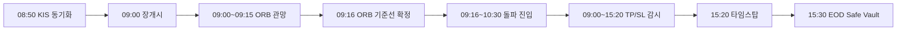
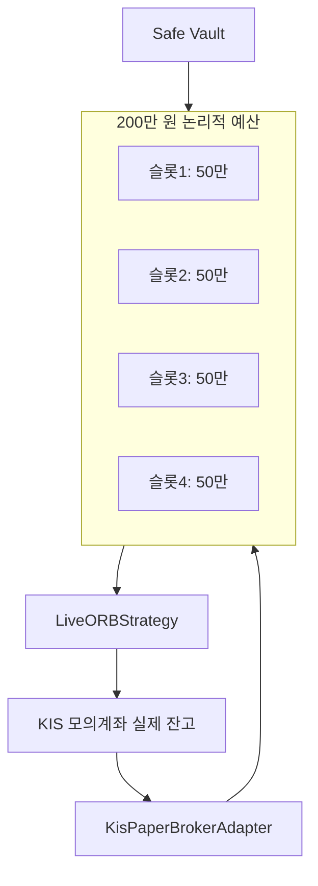

# v11.2 ORB 데이트레이딩 전략 — 단계별 상세 가이드

**문서 버전:** 1.0  
**적용 러너:** `run_v11_live_paper_trading.py`  
**전략 코어:** `src/live/live_orb_strategy.py` · `src/engine/orb_strategy_v11.py`

---

## 0. 전략 한 줄 요약

> **전일 거래대금 상위 종목** 중 단기 추세가 살아 있는 종목을 골라, **09:00~09:15 15분 ORB 박스 돌파** 시 매수하고, **분 단위 손절·익절·본전 스탑**으로 관리한 뒤 **15:20 타임스탑 · 15:30 Safe Vault EOD 정산**하는 **당일 매매 전용** 전략입니다.

| 항목 | 값 |
|------|-----|
| 운용 자본 | 200만 원 (논리적 한도) |
| 최대 동시 보유 | 4종목 |
| 종목당 베팅 | 50만 원 |
| 진입 윈도우 | 09:16 ~ 10:30 |
| 청산 | 당일 전량 (오버나잇 없음) |
| 브로커 | KIS 모의투자 (`KisPaperBrokerAdapter`) |
| 시세 | KIS 당일 1분봉 API (`KisMinuteCrawler`) |

---

## 1. 하루 운영 타임라인



| 시각 (KST) | 단계 | 동작 |
|------------|------|------|
| **08:50** | 장전 준비 | KIS 모의계좌 잔고·포지션 `sync_positions()` |
| **09:00** | 장 개시 | KIS 분봉 폴링 시작, equity 스냅샷 매 분 기록 |
| **09:00~09:15** | ORB 관망 | 15개 1분봉 수집만, **매매 없음** |
| **09:16** | 기준선 확정 | 15분 고가/저가로 ORB 박스 설정 |
| **09:16~10:30** | 진입 구간 | 돌파 조건 충족 시 시장가 매수 |
| **09:00~15:20** | 포지션 감시 | 매 분 손절·익절·본전 스탑 판단 |
| **15:20** | 타임스탑 | 잔여 포지션 강제 청산 |
| **15:30** | EOD 정산 | Safe Vault 리밸런싱, CSV/MD/DB 덤프 |

---

## 2. Phase 1 — 유니버스 선정 (장 시작 전·직후)

### 2-1. 후보 종목 스크리닝 (`fetch_prev_day_turnover_universe`)

1. **전일 영업일** 기준 KOSPI + KOSDAQ 전 종목 조회 (pykrx)
2. **거래대금** = 종가 × 거래량 으로 정렬
3. **Top 100** 추출
4. **MA5 필터** 적용:
   - 종가 > 5일 이평
   - 5일 이평 우상향 (전일 > 전전일)
5. 최종 **감시 25종목** 선정

→ "어제 돈이 몰린 종목 + 단기 상승 추세"만 남깁니다.

### 2-2. 종목별 사전 데이터 (`prepare_universe`)

감시 25종목 각각에 대해:

- **5일 평균 거래량** 계산 (진입 시 거래량 필터용)
- 종목당 **0.5초 딜레이** (API 부하·Rate Limit 방지)
- 조회 실패 종목은 `avg_volume=0`으로 스킵 후 계속 진행

---

## 3. Phase 2 — ORB 기준선 수집 (09:00 ~ 09:15)

### 3-1. 데이터 수집

- **KIS 당일 1분봉 API** (`FHKST03010200`)로 09:00부터 현재까지 OHLCV 수집
- 매 분마다 25종목 순회 폴링 (종목당 ~0.55초 간격, 타임아웃 5초)

### 3-2. 관망 규칙

- 09:15 이전에는 `on_minute_bar()`가 **진입·청산 로직을 실행하지 않음**
- 이 구간에도 **equity 스냅샷은 매 분 DB 기록** (대시보드 차트 공백 방지)

### 3-3. ORB 박스 확정 (`build_orb_setup_from_minutes`)

09:16 이후, **첫 15개 1분봉**으로 기준선 설정:

| 변수 | 계산 방식 |
|------|-----------|
| `open_px` | 09:00 봉 시가 |
| `orb_high` | 15봉 **고가 최대값** (상단 저항) |
| `orb_low` | 15봉 **저가 최소값** (하단 지지) |

조건: `orb_high > open_px`, 15봉 미만이면 해당 종목 ORB 미설정

> **⚠️ 주의 — 임시 테스트 패치**  
> 현재 `lock_orb_setups()`에 아래 코드가 있습니다.
>
> ```python
> setup.orb_high = setup.open_px * 0.5  # [임시] 돌파 기준선을 시가의 50%로 낮춤
> ```
>
> 설계상은 15분 고가 최대값이지만, **지금은 시가의 50%로 덮어쓰는 테스트 패치**가 적용되어 있습니다. 실전 운용 전 이 줄 제거 여부를 반드시 확인하세요.

---

## 4. Phase 3 — 진입 (09:16 ~ 10:30)

### 4-1. 진입 전제 조건

| # | 조건 | 설명 |
|---|------|------|
| 1 | 시간 | 09:16 ~ 10:30 사이 |
| 2 | 슬롯 | 보유 4종목 미만 (`available_slots > 0`) |
| 3 | 중복 방지 | 당일 해당 종목 미진입 (`entered_today`) |
| 4 | ORB 설정 | `setups[code]` 존재 |
| 5 | 예산 | 200만 원 한도 내 가용 현금 |

### 4-2. 돌파 판정 (`detect_orb_breakout`)

당일 누적 OHLC(09:00~현재 분봉) 기준으로 **5가지** 모두 충족해야 매수:

```
① 고가 > orb_high          (저항선 돌파)
② 종가 ≥ orb_high          (돌파 후 위에서 마감)
③ morning_thrust ≥ 25%     (장중 고가가 당일 레인지 상단 25% 이상 위치)
④ 거래량 ≥ 5일평균 × 1.2   (거래량 급증)
```

**morning_thrust** 계산:

```
morning_thrust = (당일고가 - 시가) / (당일고가 - 당일저가)
```

### 4-3. 주문 실행

- `place_market_buy()` → **KIS 모의투자 시장가 매수**
- 종목당 예산: **50만 원** (`SLOT_BUDGET`)
- 수량 = `50만 ÷ 현재가` (정수)
- 체결 후: 텔레그램 알림, CSV 기록, `entered_today` 등록

---

## 5. Phase 4 — 포지션 관리 (09:00 ~ 15:20)

보유 종목은 **매 1분봉마다** `evaluate_orb_exit()`로 청산 여부 판단합니다.  
판단에 쓰는 OHLC도 **당일 누적 분봉** 기준입니다.

### 5-1. 청산 우선순위 (위에서 먼저 발화)

| 순위 | 조건 | 액션 | 코드명 |
|------|------|------|--------|
| 1 | 저가 ≤ 진입가 × 0.975 | **전량 매도** | `STOP_LOSS` (-2.5%) |
| 2 | 고가 ≥ 진입가 × 1.05 | **전량 매도** | `TAKE_PROFIT_FULL` (+5%) |
| 3 | 고가 ≥ 진입가 × 1.03 (최초 1회) | **50% 매도** | `PARTIAL_TP_50` (+3%) |
| 4 | 본전 스탑 (3번 이후 활성) | **잔량 전량** | `RISK_FREE_BREAKEVEN` |
| 5 | 15:20 강제 | **잔량 전량** | `TIME_STOP_1520` |

### 5-2. Risk-Free(본전 락인) 메커니즘

`PARTIAL_TP_50` 실행 후:

```
partial_tp_done = True
risk_free       = True
breakeven_stop  = 진입가 (본전)
```

→ 이후 저가가 본전 이하로 내려가면 **남은 50%를 본전에서 전량 청산**합니다.  
이미 3%에서 절반을 팔았으므로, 나머지는 **원금 보호 모드**로 전환됩니다.

### 5-3. 청산 실행

- `place_market_sell()` → KIS 모의투자 시장가 매도
- DB `live_trades` INSERT, 텔레그램 알림, CSV 기록

---

## 6. Phase 5 — 장 마감 처리

### 6-1. 15:20 타임스탑 (`on_time_stop`)

- 아직 보유 중인 모든 포지션에 `force_eod=True`
- 당일 종가 proxy로 **잔량 전량 청산**

### 6-2. 15:30 EOD Safe Vault 정산 (`_run_eod_settlement`)

**Safe Vault** (`capital_buffer_manager`) 로직:

| 상황 | 동작 |
|------|------|
| 총자산 > 200만 × 1.05 (+5%) | 초과 수익을 **금고(Safe Vault)** 로 이전 (harvest) |
| 총자산 < 200만 | 금고에서 **부족분 환류** (refill) |
| 금고도 부족 | 가능한 만큼만 부분 환류 |

EOD 산출물:

| 경로 | 내용 |
|------|------|
| `outputs/v11_live_trades_YYYYMMDD.csv` | 당일 거래 덤프 |
| `outputs/v11_live_report_YYYYMMDD.md` | 일일 리포트 |
| `data/live_trading.db` | equity · trades (대시보드 SSOT) |
| 텔레그램 | EOD 정산 알림 |

---

## 7. 자금·리스크 관리 구조



| 레이어 | 역할 |
|--------|------|
| **KIS 모의계좌** | 실제 주문·체결·잔고 SSOT |
| **KisPaperBrokerAdapter** | 200만 원 예산 캡, 슬롯 4개 제한 |
| **Safe Vault** | 200만 원 기준 초과 수익 금고 보관 |
| **live_equity DB** | 매 분 총자산 스냅샷 (대시보드용) |

---

## 8. 인프라 파이프라인 (데이터 흐름)

```
KIS 분봉 API
    ↓
KisMinuteCrawler (25종 × 매분)
    ↓
LiveORBStrategy.on_minute_bar()
    ↓
┌─ 진입 → KisPaperBrokerAdapter → KIS 매수
└─ 청산 → KisPaperBrokerAdapter → KIS 매도
    ↓
live_trading.db + 텔레그램 + CSV
    ↓
Streamlit 대시보드 (1분 갱신)
```

**안전장치:**

- KIS API HTTP 타임아웃 **5초**
- 통신 실패 시 해당 종목 **스킵** (전체 봇 중단 없음)
- 가격 데이터 없으면 주문 안 나감 (하드코딩 가격 없음)
- `prepare_universe` 종목당 0.5초 딜레이
- `KisMinuteCrawler` 종목당 0.55초+ 딜레이

---

## 9. 핵심 파라미터 총정리

| 파라미터 | 값 | 위치 |
|----------|-----|------|
| `ORB_SETUP_END` | 09:15 | 관망 종료 |
| `ENTRY_START` | 09:16 | 진입 시작 |
| `ENTRY_END` | 10:30 | 진입 종료 |
| `TIME_STOP` | 15:20 | 타임스탑 |
| `EOD_SETTLE` | 15:30 | EOD 정산 |
| `STOP_LOSS_PCT` | 2.5% | 손절 |
| `PARTIAL_TP_PCT` | 3.0% | 부분 익절 |
| `FULL_TP_PCT` | 5.0% | 전량 익절 |
| `PARTIAL_SELL_RATIO` | 50% | 부분 매도 비율 |
| `MORNING_THRUST_MIN` | 25% | 장 초반 추세 강도 |
| `VOLUME_SURGE_RATIO` | 1.2× | 거래량 급증 배수 |
| `DEFAULT_INITIAL_CASH` | 200만 | 운용 자본 |
| `MAX_SLOTS` | 4 | 최대 보유 |
| `SLOT_BUDGET` | 50만 | 종목당 베팅 |
| `DEFAULT_WATCH_SIZE` | 25 | 감시 종목 수 |
| `TOP_N_TURNOVER` | 100 | 거래대금 상위 N |
| `KIS_HTTP_TIMEOUT` | 5초 | API 타임아웃 |

---

## 10. 전략 설계 철학

1. **ORB 15분 박스** — 장 초반 가격 레인지가 하루 방향성의 기준선이 된다는 가정
2. **10:30 진입 마감** — 오전 모멘텀만 노리고 오후 노이즈 회피
3. **3% 부분익절 + 본전 스탑** — 수익 확정 후 나머지는 무위험(risk-free) 전환
4. **당일 전량 청산** — 오버나잇 갭 리스크 제거
5. **200만 원 캡 + Safe Vault** — 소액 계좌에서도 복리·손실 관리 구조화
6. **거래대금 Top + MA5** — 유동성·추세 필터로 잡주·역추세 진입 억제

---

## 11. 실행 모드

| 명령 | 브로커 | 시세 | 용도 |
|------|--------|------|------|
| `--mock --speed 0` | 로컬 가상 | Mock 생성 | 장외 전략 검증 |
| `--dry-run` | KIS(dry) | KIS API | API 연결·동기화 확인 |
| (기본) | KIS 실주문 | KIS API | **실전 운용** |
| `--local` | 로컬 가상 | KIS API | 브로커만 로컬, 시세는 KIS |
| `--reset` | — | — | DB/레거시 초기화 후 종료 |

```powershell
# 초기화
.\venv\Scripts\python run_v11_live_paper_trading.py --reset

# 오프라인 검증
.\venv\Scripts\python run_v11_live_paper_trading.py --mock --speed 0

# KIS 연결 테스트
.\venv\Scripts\python run_v11_live_paper_trading.py --dry-run

# 실운용
.\venv\Scripts\python run_v11_live_paper_trading.py

# 대시보드드
.\venv\Scripts\streamlit run dashboard/live_dashboard.py

.\venv\Scripts\python run_v11_live_paper_trading.py
```

---

## 12. 관련 문서·파일

| 문서/파일 | 설명 |
|-----------|------|
| `docs/v11_live_morning_sop.md` | 장전 운영 SOP |
| `run_v11_live_paper_trading.py` | 마스터 러너 |
| `src/live/live_orb_strategy.py` | 라이브 ORB 전략 |
| `src/engine/orb_strategy_v11.py` | ORB 수학 코어 (백테스트 공유) |
| `src/live/kis_paper_adapter.py` | KIS 브로커 어댑터 |
| `src/live/kis_minute_crawler.py` | KIS 분봉 폴링 |
| `dashboard/live_dashboard.py` | Streamlit 관제 대시보드 |

---

## 13. 현재 코드에서 확인할 사항

1. **`lock_orb_setups` 임시 패치** — `orb_high = open_px * 0.5` 가 들어가 있어 설계와 다르게 동작할 수 있습니다.
2. **`.env` KIS 설정** — `KIS_PAPER_*` 키·모의계좌번호, `LIVE_DRY_RUN=0` (실주문 시)
3. **실전 계좌 오발송 방지** — v11은 `mode=paper` 강제, `KIS_PAPER_ACCOUNT_NUMBER` 사용

---

*최종 갱신: 2026-06-18 · v11.2 KIS API 전면 이식 기준*
