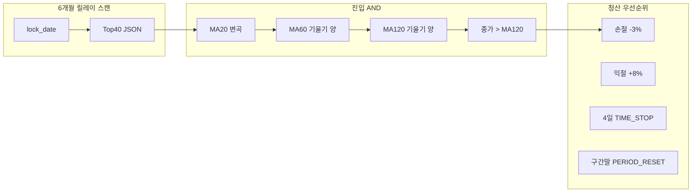

# v5 Kosdaq Sniper — 최종 DoD 리포트 (v5.5.2 Freeze)

**작성일:** 2026-06-03  
**브랜치:** `v5.0`  
**SSOT:** `config/settings.yaml` → `v5_5` (v5.5.2 동결)  
**실행기:** `python run_v5_relay_portfolio.py`  
**산출물:** `outputs/v5_relay_equity_curve.csv`, `outputs/v5_relay_trades.csv`

---

## 1. Executive Summary

v5 시리즈는 **「20일선 변곡점 + 코스닥 중소형 주도주」** 가설을 출발점으로, 국장 특유의 **윗꼬리·단발 테마·하락장 폭탄**을 데이터로 확인한 뒤, **청산·유니버스·대세 필터**를 단계적으로 개선하여 **v5.5.2**에서 **수치 튜닝을 종결(Freeze)** 했다.

| 항목 | v5.5.2 동결값 |
|------|----------------|
| 진입 | MA20 변곡 + MA60↑ + MA120↑ + 종가>MA120 |
| 유니버스 | 6개월 릴레이 · lock_date 박제 Top40 (코스닥 700억~3,000억 · 거래대금≥50억) |
| 익절 | **+8%** (`target_profit_ratio: 0.08`) |
| 손절 | **-3%** (`stop_loss_ratio: 0.03`) |
| 타임스탑 | **4영업일** (`max_hold_days: 4`) |
| 자본 | field_test 10만 원 · 슬롯 2 × 5만 원 |

**정책:** v5.5.2 이후 **손익비·보유일·이평 필터 수치 변경 금지**. 다음 단계는 코드 튜닝이 아니라 **문서·인프라·실전 운용**이다.

---

## 2. 튜닝 여정 타임라인

### v5.0 — 변곡점 스나이퍼 + MA20 추세 청산

- **진입:** 어제 종가 ≤ MA20, 오늘 종가 > 20영업일 전 종가 → 종가 매수
- **청산:** 종가 < MA20 (`TREND_EXIT_MA20`)
- **field_test (전종목·920영업일):** 10만 → **약 6.6만 원**, PF **0.82**, MDD **-86%**
- **교훈:** 변곡 신호 자체는 맞는 경우가 있으나, **윗꼬리 차익·거래량 실종** 시 MA20 추세 청산이 손실만 누적

### v5.1 — 고정 유니버스 락 (Look-ahead 차단)

- `lock_date: 2022-12-29` 시점 **거래대금 Top40** JSON 박제
- pykrx 과거 0값 → **FDR 폴백** + 캐시 (`data/cache/v5_universe_lock/`)
- 승률·PF는 여전히 부진 → **유니버스는 필요조건, 충분조건 아님**

### v5.2 — Hit & Run 청산

- MA20 청산 폐기 → **+6% / -3% / 3일** 장중 H/L 청산
- 국장 **단발 파도**에 맞춘 구조 전환

### v5.3 — 6개월 릴레이 (주도주 교체)

- 2023-01-01 ~ 2026-05-31 · **7구간** · 구간 종료 `PERIOD_RESET` · 자산 이월
- `config/relay_universes/univ_phase_1~7.json` + `relay_manifest.json`
- **효과:** 시대별 돈줄(에코프로·반도체·바이오 등) 추적, 잡주 늪 완화

### v5.4 — 장기 이평 가격 필터

| 필터 | 최종 자산 (대표 실행) | 거래 횟수 | 해석 |
|------|----------------------|-----------|------|
| MA60 (종가>MA60) | **68,842원** | 204회 | 박스권 **가짜 변곡** 과다 진입 |
| MA120 (종가>MA120) | **100,623원** | 34회 | **흑자 전환** · 5·7구간(2025~26) **0건**으로 하락장 회피 |

### v5.5 — 듀얼 우상향 (Dual Slope)

- **추가 조건:** MA60(오늘)>MA60(어제) **AND** MA120(오늘)>MA120(어제) **AND** 종가>MA120
- **효과:** 역배열 속 가짜 반등 제거 · **진성 대세 모멘텀**만 압축
- 2구간 미세 손실 등 **횡보 속임수** 추가 억제

### v5.5.2 — 손익비·보유일 골든 동결 ★

| 파라미터 | v5.2 초기 | **v5.5.2 동결** | 근거 |
|----------|-----------|-----------------|------|
| 익절 | +6% | **+8%** | 주도주 파동 임계·수익 캡처 |
| 손절 | -3% | **-3%** | 하방 마진·손익비 2.67 유지 |
| 타임스탑 | 3일 | **4일** | 골든 보유 구간 |

---

## 3. v5.5.2 아키텍처 (낚싯바늘 규격)



### 핵심 파일

| 역할 | 경로 |
|------|------|
| SSOT | `config/settings.yaml` → `v5_5` |
| 설정 로더 | `src/v5_config.py` (`load_v5_relay_config`) |
| 릴레이 스캔 | `src/v5_relay_screener.py` |
| 포트 엔진 | `src/engine/portfolio_manager_v5.py` |
| 릴레이 러너 | `run_v5_relay_portfolio.py` |
| 유니버스 | `config/relay_universes/` |

### 릴레이 7구간

| 구간 | 백테스트 | lock_date |
|------|----------|-----------|
| 1 | 2023-01-01 ~ 2023-06-30 | 2022-12-29 |
| 2 | 2023-07-01 ~ 2023-12-31 | 2023-06-29 |
| 3 | 2024-01-01 ~ 2024-06-30 | 2023-12-28 |
| 4 | 2024-07-01 ~ 2024-12-31 | 2024-06-27 |
| 5 | 2025-01-01 ~ 2025-06-30 | 2024-12-30 |
| 6 | 2025-07-01 ~ 2025-12-31 | 2025-06-27 |
| 7 | 2026-01-01 ~ 2026-05-31 | 2025-12-29 |

---

## 4. DoD 체크리스트 (v5 브랜치 마감)

- [x] SSOT `v5_5` v5.5.2 파라미터 동결 (`+8%` / `-3%` / `4일`)
- [x] 릴레이 + 듀얼 슬로프 + Hit&Run 엔진 코드 완료
- [x] 실행 전 Y/N · `--section` · `--scan-only` 인프라
- [x] 본 리포트 (`outputs/v5_final_report.md`)
- [ ] (선택) `run_v5_tune.py` 그리드 — **v5.5.2 동결로 스코프 아웃**
- [ ] (후속) Harness GUI 연동 · 실전 주문 브릿지

---

## 5. 재현 방법

```powershell
# 유니버스 없을 때 (최초 1회)
.\venv\Scripts\python.exe run_v5_relay_portfolio.py --scan-only

# v5.5.2 릴레이 백테스트 (대화형)
.\venv\Scripts\python.exe run_v5_relay_portfolio.py

# 무질문 실행
.\venv\Scripts\python.exe run_v5_relay_portfolio.py --yes --no-scan
```

비교 실험(동결 전 버전):

```powershell
.\venv\Scripts\python.exe run_v5_relay_portfolio.py --section v5_4 --no-scan --yes
.\venv\Scripts\python.exe run_v5_relay_portfolio.py --section v5_3 --no-scan --yes
```

---

## 6. 교훈 (대표님 직관 ↔ 데이터)

1. **변곡점만으로는 부족** — 국장 중소형은 「돌파 당일 = 분배」 패턴이 잦다.
2. **유니버스 락 + 릴레이** — Look-ahead 제거와 **시대별 주도주** 추적이 생존의 전제.
3. **120일선·듀얼 기울기** — 하락장(2025~26)에서 **거래 0건**으로 계좌 방어.
4. **+8% / -3% / 4일** — 추세 추종이 아닌 **Hit & Run 골든 존**; 추가 수치 스윕은 **동결**.

---

*v5.5.2 — Code Freeze. 다음 전술은 인프라·문서·실전 운용.*
